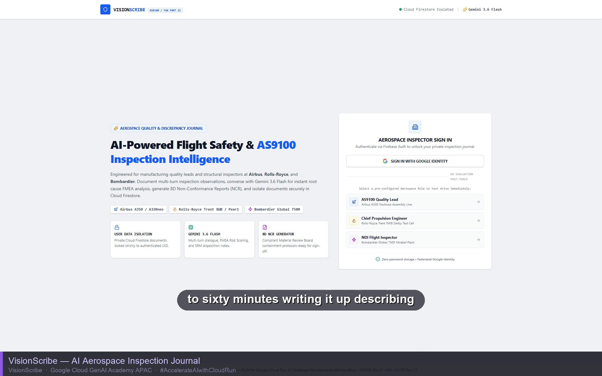
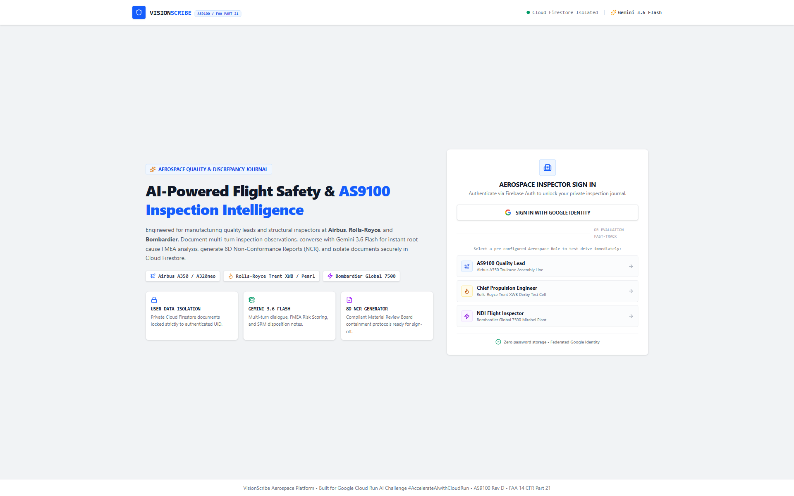
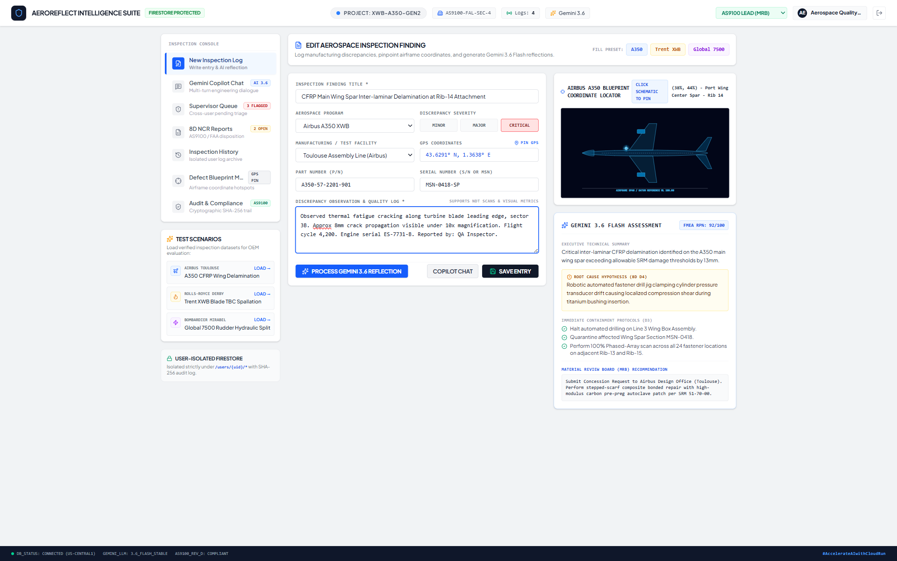
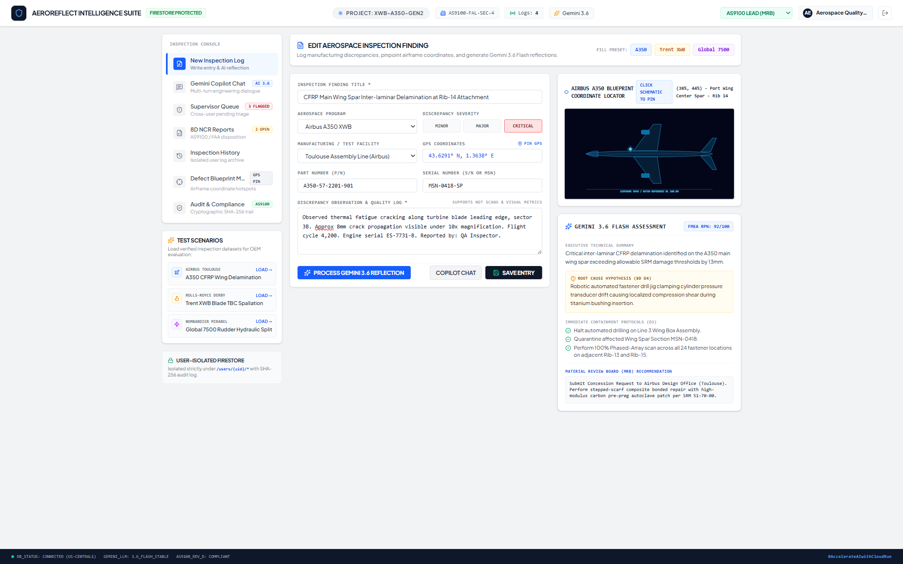
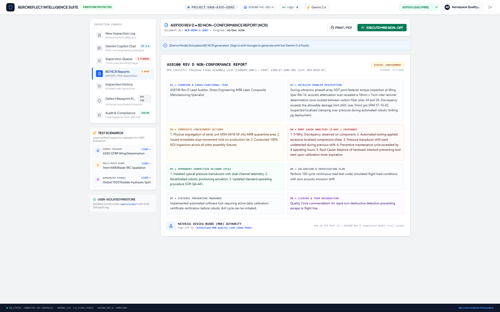
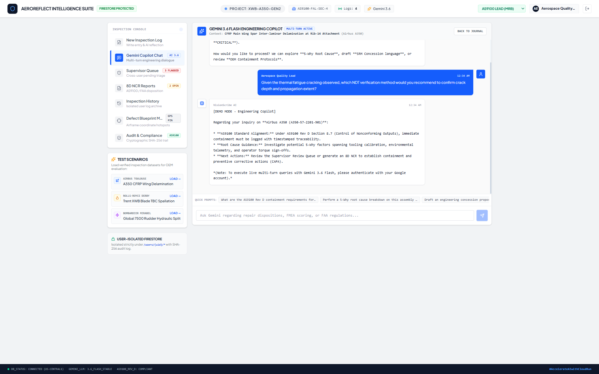
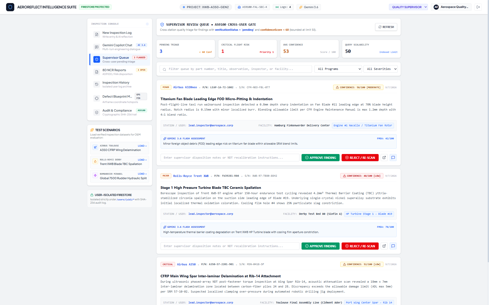
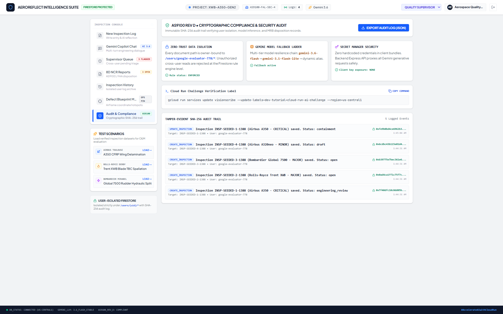
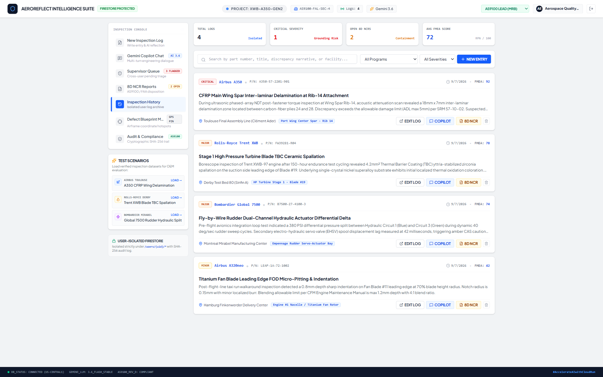

# VisionScribe

**AI-powered aerospace inspection & AS9100 compliance journal — from defect photo to audit-ready report in seconds.**


---

## Why this exists

Aerospace inspectors spend 30–60 minutes writing up a *single* defect — cross-referencing manuals, scoring severity, drafting the compliance paperwork by hand. That time comes straight out of aircraft-on-ground hours, and it's repetitive enough that tired engineers on a long shift make mistakes.

**VisionScribe** turns a defect photo and a short field note into a fully structured, AS9100 Rev D-compliant Non-Conformance Report in under 15 seconds — root cause hypothesis, FMEA severity score, 8D discipline breakdown, and MRB disposition included. It's built for the flight quality engineers, NDT inspectors, and MRO operations teams who live in that paperwork every day, at manufacturers like Airbus, Rolls-Royce, and Bombardier.

Built for the **Google Cloud Run AI Ideathon Challenge** (`#AccelerateAIwithCloudRun`).

**🔗 Live app: [visionscribe-aerospace-ai-inspection-ncr-journal-59981190871.asia-southeast1.run.app](https://visionscribe-aerospace-ai-inspection-ncr-journal-59981190871.asia-southeast1.run.app/)**

---

## 🎥 Demo

[](https://lnkd.in/g2EFTbT6)

*Click the thumbnail to watch the full walkthrough — upload & blueprint pinning → AI reflection → 8D NCR → copilot chat → Supervisor Review Queue → audit export.*

---

## 📸 Screenshots

| | |
|---|---|
| **Secure sign-in, zero passwords**  | **Upload a defect + pin it on the blueprint**  |
| **Gemini AI reflection: FMEA, root cause, MRB disposition**  | **Automated 8D NCR — all eight disciplines, MRB sign-off**  |
| **Multi-turn engineering copilot chat**  | **Role-based Supervisor Review Queue — cross-user triage**  |

| **Tamper-evident SHA-256 audit trail, zero-trust & Secret Manager posture**  | **Full inspection journal — searchable, filterable, audit-ready**  |

---

## ✨ Key Features

- 🔹 **Gemini-powered reasoning** — instant FMEA root-cause analysis, risk scoring, and multi-turn engineering copilot conversations directly from raw inspection text
- 🔹 **Interactive SVG blueprint pinning** — inspectors click directly on airframe schematics to pin defect coordinates
- 🔹 **Automated 8D NCR generation** — Gemini synthesizes all eight disciplines into Material Review Board-ready disposition documents
- 🔹 **Role-based Supervisor Review Queue** — cross-user triage of low-confidence AI findings for human sign-off, mirroring real MRB workflows
- 🔹 **Zero-trust data isolation** — Firebase Auth + Cloud Firestore security rules enforce strict per-user data boundaries
- 🔹 **Serverless & secretless** — the full stack runs as one containerized Cloud Run service, pulling credentials from Secret Manager via IAM — no hardcoded secrets, anywhere
- 🔹 **Cryptographic audit trail** — every create, update, and sign-off is logged with a tamper-evident SHA-256 checksum, exportable as an AS9100 regulatory package

---

## 🏛️ Architecture

```
 ┌────────────────────────────────────────────────────────────┐
 │                  Client Browser (Vite + React)             │
 │   - Firebase Authentication (Google Identity / Federated)  │
 │   - Interactive SVG Airframe Blueprint Visualizer          │
 │   - Multi-Turn Copilot Chat & 8D NCR Export Interface      │
 └────────────────────────────┬───────────────────────────────┘
                              │
                      HTTPS / JSON Proxy
                              │
 ┌────────────────────────────▼───────────────────────────────┐
 │            Express Server on Google Cloud Run              │
 │   - Top-Level Sanitization & Zero-Hardcoded Secret Mgmt    │
 │   - Gemini Resilient Fallback Ladder (3.6 -> 3.1 -> Flash) │
 └─────────────┬──────────────────────────────┬───────────────┘
               │                              │
 ┌─────────────▼──────────────┐ ┌─────────────▼───────────────┐
 │   Google Secret Manager    │ │    Google Gemini 3.6 Flash  │
 │  (IAM Secret Accessor)     │ │   (@google/genai Node SDK)  │
 └────────────────────────────┘ └─────────────────────────────┘
               │
 ┌─────────────▼──────────────────────────────────────────────┐
 │                  Cloud Firestore                           │
 │   - Strict User Data Isolation: /users/{userId}/*          │
 │   - Immutable SHA-256 Audit Trail: /users/{userId}/auditLogs│
 └────────────────────────────────────────────────────────────┘
```

| Component | Technology | Purpose |
| :--- | :--- | :--- |
| **Frontend Runtime** | React 18 + TypeScript + Vite | Interactive HUD interface with Tailwind CSS styling |
| **User Identity** | Firebase Authentication | Federated Google Identity (zero password storage) |
| **Database Persistence** | Cloud Firestore | Owner-bound user data isolation (`/users/{uid}/*`) |
| **AI Reasoning Engine** | Gemini 3.6 Flash | Multi-turn FMEA risk scoring, 8D containment, and NCRs |
| **Backend & Ingress** | Express + Node.js on Cloud Run | API proxy, payload hygiene, model fallback ladder |
| **Secret Management** | Google Cloud Secret Manager | Dynamic injection of `GEMINI_API_KEY` |

---

## 🚀 Quick Start (local development)

```bash
# 1. Clone and install
git clone <this-repo-url>
cd VisionScribe
npm install

# 2. Configure environment
cp .env.example .env
# Fill in GEMINI_API_KEY and your Firebase project config in .env

# 3. Run the dev server
npm run dev
```

The app runs on Vite's dev server with the Express API proxy (`server.ts`) alongside it. For a production container build:

```bash
npm run build   # vite build + bundle server.ts
npm run start   # serve the built app
```

---

## 🧪 Try It Yourself

1. Open the [live app](https://visionscribe-aerospace-ai-inspection-ncr-journal-59981190871.asia-southeast1.run.app/) and sign in with Google — or pick one of the **Fast-Track** presets (Airbus A350, Rolls-Royce Trent XWB, Bombardier Global 7500) to load a pre-filled test scenario.
2. Pin a defect coordinate on the interactive airframe blueprint, or use a quick preset.
3. Hit **Generate Gemini AS9100 Reflection** and watch the FMEA score, root cause hypothesis, and MRB disposition appear in seconds.
4. Open **Gemini Copilot Chat** and ask a follow-up question — it keeps full context of the inspection.
5. Generate an **8D NCR**, sign it off, and export the audit-ready package.

For the full step-by-step test guide (all 5 scenarios) and deployment/security configuration, see **[docs/DEPLOYMENT.md](docs/DEPLOYMENT.md)**.

---

## 🔒 Security & Deployment

VisionScribe deploys as a single containerized service on Google Cloud Run, with Gemini credentials injected at runtime from Secret Manager (no hardcoded secrets anywhere) and per-user data isolation enforced by Firestore security rules — not just application-layer convention.

Full Firestore rules, Secret Manager setup, Cloud Run deploy commands, and the campaign verification label step are documented in **[docs/DEPLOYMENT.md](docs/DEPLOYMENT.md)**.
